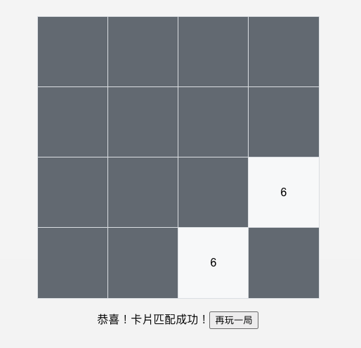

# Memory Card Game

A memory card game created using Create React App.
Project: [DEMO](https://memory-card-game-ya.vercel.app)

This is a small game called "Memory Card Game." In the game, cards are shuffled and randomly arranged on the screen. Players need to click on two cards to see if they match. If the two cards match, they will remain flipped open; if not, the cards will flip back to their original state. The goal of the game is to find all matching card pairs in the shortest time possible.

### User Story

1. As a user, I want to be able to automatically flip cards.
2. As a user, I want to be able to click on two cards to see if they match. If they match, the cards should remain flipped; if they don't match, the cards should flip back to their original state.
3. As a user, I want to have a "Play Again" button after completing the game.

ϵ( 'Θ' )϶

### Deploy

Clone the project to your local.

`npm install`
`npm start`

---

# 記憶卡牌小遊戲

使用 Create React App 製作的記憶卡牌小遊戲。
專案： [DEMO](https://memory-card-game-ya.vercel.app)

這是一款名為「記憶卡牌遊戲」的小遊戲。在遊戲中，卡片會被打亂並隨機排列在螢幕上。玩家需要點擊兩張卡片以檢視它們是否相符。如果兩張卡片相符，它們將保持翻開狀態；如果不相符，卡片將會翻回原狀。遊戲的目標是在最短的時間內找出所有匹配的卡片組合。

### 使用者故事

1. 身為一個使用者，我希望可以自動蓋牌。
2. 身為一個使用者，我希望可以點擊兩張卡片來檢視它們是否相符。若相符，卡片便保持翻開；若不符，卡片則會翻回原狀。
3. 身為一個使用者，我希望可以破解遊戲後有一顆再玩一次的按鈕。

ᶘ ᵒᴥᵒᶅ

### 部署

clone 專案至本地端

`npm install`
`npm start`
